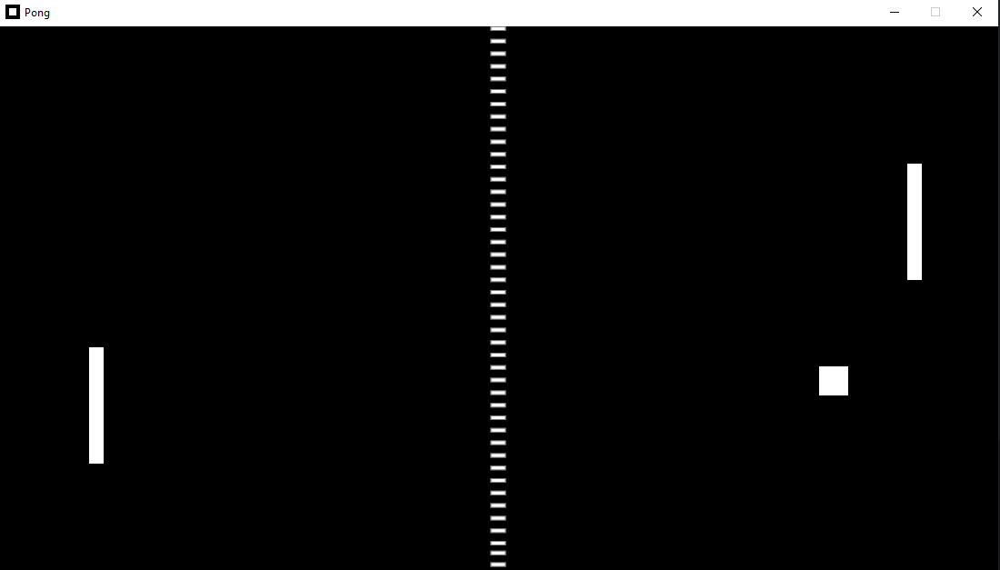

# **Pong**

Pong programmed through python using pygame with a desire to understand how to mix object oriented programming with the pygame module.

### **Developed by:**

+ [Luis Solano](https://github.com/GoninDS) (art / programming)

## **Requirements**

+ Python installed (tested with Python 3.9.5) 

+ Pygame installed (tested with Pygame 2.1.2)

